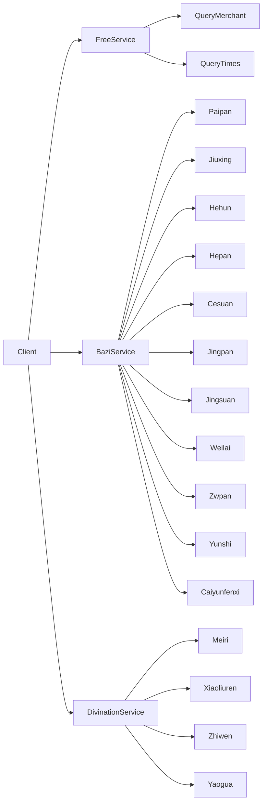
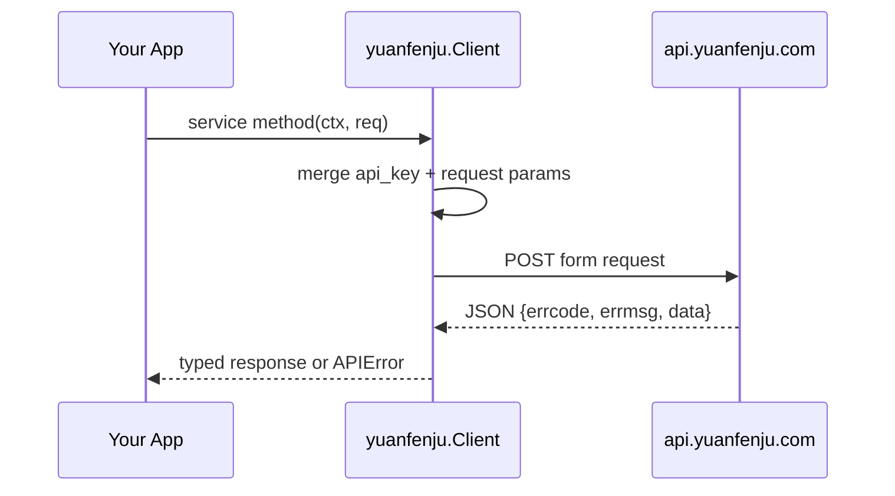

# yuanfenju-go-sdk

`yuanfenju-go-sdk` 是一个面向 Service 的 Go SDK，目标是为 [缘份居 API 文档](https://doc.yuanfenju.com/other/sitemap.html) 提供统一、类型安全、易扩展的调用方式。

> 当前为 **v0 骨架阶段**：优先实现关键接口，后续逐步补全全量接口。

## 特性

- 面向 `Service` 的现代化 SDK 结构（`client.Free` / `client.Bazi` / `client.Divination`）
- 统一请求入口、统一错误模型、统一响应结构
- 返回数据使用结构体建模（避免 `map` / `json.RawMessage` 动态结构）
- 支持 `context.Context`、自定义 `http.Client`、可配置 Base URL
- 前期内置关键接口：
  - 免费：账户查询、调用查询
  - 八字：八字排盘、九星命理、八字合婚、八字合盘、八字测算、八字精盘、八字精算、未来运势、紫微排盘、八字每日运势、流年财运分析
  - 占卜：每日一占、小六壬占卜、指纹占卜、摇卦占卜

## 安装

```bash
go get github.com/Scorpio69t/yuanfenju-go-sdk
```

## 快速开始

```go
package main

import (
    "context"
    "fmt"
    "log"
    "time"

    yuanfenju "github.com/Scorpio69t/yuanfenju-go-sdk"
)

func main() {
    client, err := yuanfenju.NewClient(yuanfenju.Config{
        APIKey: "your_api_key",
        Timeout: 10 * time.Second,
    })
    if err != nil {
        log.Fatal(err)
    }

    resp, err := client.Free.QueryMerchant(context.Background())
    if err != nil {
        log.Fatal(err)
    }

    fmt.Printf("账号类型: %s\n", resp.Data.MerchantType)
}
```

## 服务结构



## 请求生命周期



## 已实现接口（v0）

| 分类 | 方法 | 对应接口 |
|---|---|---|
| Free | `client.Free.QueryMerchant` | `/v1/Free/querymerchant` |
| Free | `client.Free.QueryTimes` | `/v1/Free/querytimes` |
| Bazi | `client.Bazi.Paipan` | `/v1/Bazi/paipan` |
| Bazi | `client.Bazi.Jiuxing` | `/v1/Bazi/jiuxing` |
| Bazi | `client.Bazi.Hehun` | `/v1/Bazi/hehun` |
| Bazi | `client.Bazi.Hepan` | `/v1/Bazi/hepan` |
| Bazi | `client.Bazi.Cesuan` | `/v1/Bazi/cesuan` |
| Bazi | `client.Bazi.Jingpan` | `/v1/Bazi/jingpan` |
| Bazi | `client.Bazi.Jingsuan` | `/v1/Bazi/jingsuan` |
| Bazi | `client.Bazi.Weilai` | `/v1/Bazi/weilai` |
| Bazi | `client.Bazi.Zwpan` | `/v1/Bazi/zwpan` |
| Bazi | `client.Bazi.Yunshi` | `/v1/Bazi/yunshi` |
| Bazi | `client.Bazi.Caiyunfenxi` | `/v1/Bazi/caiyunfenxi` |
| Divination | `client.Divination.Meiri` | `/v1/Zhanbu/meiri` |
| Divination | `client.Divination.Xiaoliuren` | `/v1/Zhanbu/xiaoliuren` |
| Divination | `client.Divination.Zhiwen` | `/v1/Zhanbu/zhiwen` |
| Divination | `client.Divination.Yaogua` | `/v1/Zhanbu/yaogua` |

## 扩展路线

- 新增服务：`ToolsService`、`PairingService`、`PredictionService` 等
- 为复杂响应提供更完整的 typed model
- 增加重试策略、签名策略、可观测性（日志/trace hook）

更多设计细节见：[`docs/design.md`](docs/design.md)
- 全接口实施路线：[`docs/full-coverage-roadmap.md`](docs/full-coverage-roadmap.md)
- 接口台账（实施中）：[`docs/interface-catalog.md`](docs/interface-catalog.md)

