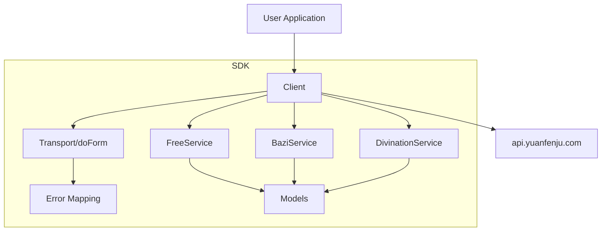
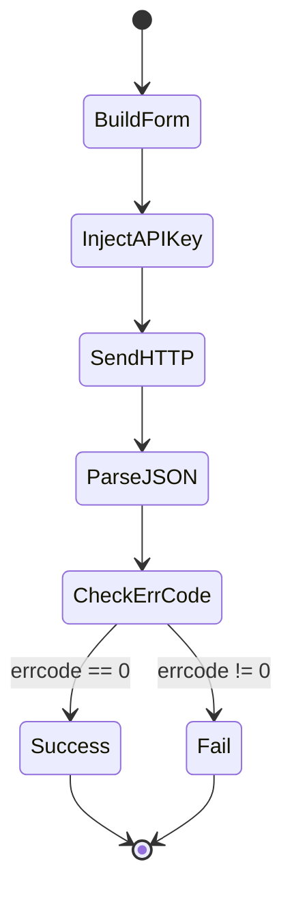

# yuanfenju-go-sdk 设计方案（Service-Oriented）

## 1. 设计目标

1. **可扩展**：先实现关键接口，再逐步补齐 sitemap 中的所有接口。
2. **易使用**：统一 Client + Service 调用方式，降低调用成本。
3. **强约束**：提供 typed request/response，减少字符串拼接错误。
4. **可维护**：把公共逻辑沉淀到 `Client.doForm`，业务逻辑留在 service。

## 2. 总体架构



## 3. 目录规划

```text
.
├── client.go            # Client、Config、通用请求与错误模型
├── service_free.go      # 免费接口（账户查询、调用查询）
├── service_bazi.go      # 八字接口（八字排盘）
├── service_divination.go# 占卜接口（每日一占）
├── examples/
│   └── basic/main.go    # 最小可运行示例
├── docs/
│   └── design.md        # 设计说明（本文）
└── README.md
```

## 4. Service 风格 API 设计

```go
client, _ := yuanfenju.NewClient(yuanfenju.Config{APIKey: "xxx"})

merchant, _ := client.Free.QueryMerchant(ctx)
paipan, _ := client.Bazi.Paipan(ctx, yuanfenju.BaziPaipanRequest{...})
meiri, _ := client.Divination.Meiri(ctx, yuanfenju.MeiriRequest{Lang: "zh-cn"})
```

### 原则

- 每个 `Service` 只关心“参数组装 + endpoint path”。
- 请求发送、HTTP 状态检查、JSON 解析、`errcode` 判错由 `Client` 统一处理。
- 返回统一包裹结构：`CommonResponse[T]`。

## 5. 请求与错误处理流程



### 错误模型

- 网络错误：原样返回（`net/http` error）
- 非 2xx：返回 `HTTP <status>` 错误
- 业务错误（`errcode != 0`）：返回 `*APIError`

## 6. v0 关键接口优先级

| 优先级 | 分类 | 接口 | 说明 |
|---|---|---|---|
| P0 | Free | `querymerchant` | 快速验证 API Key 可用性 |
| P0 | Free | `querytimes` | 统计调用消耗与刷新时间 |
| P0 | Bazi | `paipan` | 代表性核心业务接口 |
| P0 | Zhanbu | `meiri` | 最简单的占卜类接口，便于快速接入 |

## 7. 后续扩展策略

### 7.1 服务扩展

- 新增 `ToolsService`、`PairingService`、`PredictionService`
- 遵循同一模式：`service_xxx.go` + typed request/response

### 7.2 稳定性增强

- Retry（可选，幂等接口优先）
- Hook（日志、指标、链路追踪）
- 限流与熔断（可插拔中间件）

### 7.3 版本策略

- `v0.x`: 快速覆盖高频接口
- `v1.0`: 固化 API 设计，提供完整文档与兼容承诺

## 8. 与文档的映射（当前）

- `https://api.yuanfenju.com/index.php/v1/Free/querymerchant`
- `https://api.yuanfenju.com/index.php/v1/Free/querytimes`
- `https://api.yuanfenju.com/index.php/v1/Bazi/paipan`
- `https://api.yuanfenju.com/index.php/v1/Zhanbu/meiri`

> 注：后续接口补充时，优先从 sitemap 按分类增量实现，确保 SDK 迭代可控。
