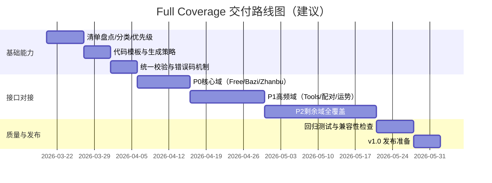
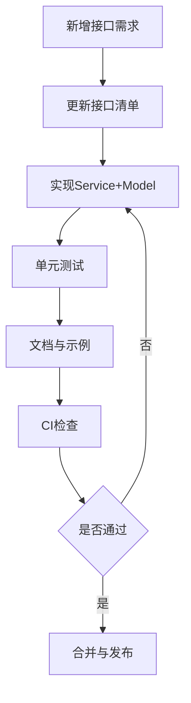

# yuanfenju-go-sdk 全接口对接实施方案（Full Coverage Roadmap）

> 目标：按“可持续交付”的方式，逐步实现缘份居文档中全部接口的 Go SDK 对接，并保证可维护性、可测试性与版本稳定性。

## 1. 目标与完成定义（Definition of Done）

### 1.1 总目标

- SDK 支持 sitemap 中全部可公开访问接口。
- 每个接口具备：
  - Service 方法；
  - 请求参数结构体（含校验）；
  - 响应结构体（优先强类型）；
  - 使用示例；
  - 最少一个自动化测试（单测或集成测试桩）。

### 1.2 DoD（按接口）

一个接口“完成”需满足：

1. 代码：Service 方法可调用并返回统一错误模型。
2. 模型：请求参数强类型、字段注释完整、必要参数有校验。
3. 测试：
   - 单测覆盖成功响应 + 业务错误响应 + HTTP 非 2xx。
4. 文档：README/服务文档中可查到方法签名与示例。
5. 可观测：请求 trace 信息可通过 hook 输出（后续统一支持）。

---

## 2. 实施原则

1. **先盘点再开发**：先把接口清单结构化，不边看文档边零散开发。
2. **分域分批推进**：按业务域（Bazi / Zhanbu / Tools / 配对等）逐批上线。
3. **统一规范先行**：先固化代码模板、命名规则、错误处理，再批量生成。
4. **低风险增量**：每批次保证可发布，避免“大爆炸式”一次性合并。
5. **文档与代码同步**：接口上线时文档与示例必须同批提交。

---

## 3. 分阶段路线图

---

## 4. 工作分解结构（WBS）

## 阶段 A：接口清单治理（必须先做）

### A1. 建立 `interface_catalog.md`（单一事实源）

字段建议：

- `domain`：业务域（bazi / zhanbu / tools / ...）
- `name_cn`：接口中文名
- `method_name`：SDK 方法名
- `http_method`：POST/GET
- `path`：`/v1/...`
- `priority`：P0/P1/P2
- `status`：todo/in_progress/done
- `response_typed`：typed struct（禁止 map/raw json）
- `test_status`：none/unit/integration

### A2. 统一命名规范

- Service：`XxxService`
- 方法：`UpperCamelCase`，例如 `QueryMerchant`
- 请求结构：`XxxRequest`
- 响应结构：`XxxData` + `CommonResponse[T]`

### A3. 建立模板

- 新增接口时最少改动 4 类文件：
  - service 文件
  - model 文件（可按域拆分）
  - 单测文件
  - README/API 索引

---

## 阶段 B：核心能力补全（在全覆盖前完成）

### B1. 参数校验

- 新增 `Validate()` 约定：
  - 必填缺失直接返回本地错误；
  - 可枚举参数做白名单校验；
  - 日期/时间字段格式检查。

### B2. 错误体系升级

- 抽象错误类型：
  - `ErrValidation`
  - `ErrHTTP`
  - `ErrDecode`
  - `ErrAPI`（现有 `APIError`）

### B3. Hook / Middleware 机制

- 目标：支持日志、指标、trace，不侵入业务代码。
- 提供可选 `BeforeRequest` / `AfterResponse` hook。

### B4. 可测试传输层

- `Client` 支持注入自定义 `RoundTripper`。
- 所有 service 单测通过 `httptest.Server` 完成。

---

## 阶段 C：按业务域全量对接

## C1. 交付批次策略

每个业务域按以下步骤推进：

1. 阅读域内文档并更新清单。
2. 一次提交 3~8 个接口（避免 PR 过大）。
3. 每个接口附 1 个示例（可复用示例程序）。
4. 合并前跑全量测试。

## C2. 建议批次

1. **Batch-1（P0）**：Free / Bazi / Zhanbu 核心接口补全到完整。
2. **Batch-2（P1）**：Tools / 配对 / 运势等高频调用域。
3. **Batch-3（P2）**：剩余长尾接口全量收口。

---

## 5. 质量保障策略

### 5.1 测试矩阵

- 单元测试：参数校验、错误映射、JSON decode。
- 合约测试：对关键接口保存样例响应（golden files）。
- 集成测试：使用真实 API Key（CI 可选，默认跳过）。

### 5.2 兼容性策略

- 主版本内保持 API 向后兼容。
- 字段新增尽量不破坏现有结构体行为。
- 不兼容调整通过 `v2` 规划处理。

---

## 6. 文档规划

1. `README.md`：快速开始 + 服务列表（简版）
2. `docs/design.md`：架构原则（已存在）
3. `docs/full-coverage-roadmap.md`：本实施路线（本文）
4. （下一步建议）`docs/interface-catalog.md`：全接口状态台账
5. （下一步建议）`docs/changelog.md`：按批次记录新增接口

---

## 7. 里程碑与验收

| 里程碑 | 目标 | 验收标准 |
|---|---|---|
| M1 | 完成清单治理与模板化 | 有可维护台账，新增接口流程标准化 |
| M2 | P0 全量完成 | Free/Bazi/Zhanbu 全接口可用、含测试与示例 |
| M3 | P1 完成 | 高频域接口可用率 >= 95% |
| M4 | Full Coverage | sitemap 全接口支持、文档完备 |
| M5 | v1.0 | 语义化版本发布，稳定 API 承诺 |

---

## 8. 下一步（立即执行）

建议按以下顺序开始：

1. 建立 `docs/interface-catalog.md`，从 sitemap 抽取完整接口列表并标记优先级。
2. 引入 `Validate()` 机制与统一本地校验错误类型。
3. 为现有 4 个接口补单元测试基线（成功/失败/业务错误）。
4. 启动 Batch-1：把 Free/Bazi/Zhanbu 域补到“域内完整”。

> 执行建议：后续每次迭代控制在“一个域或一个小批次”，确保能持续发布与快速回归。
