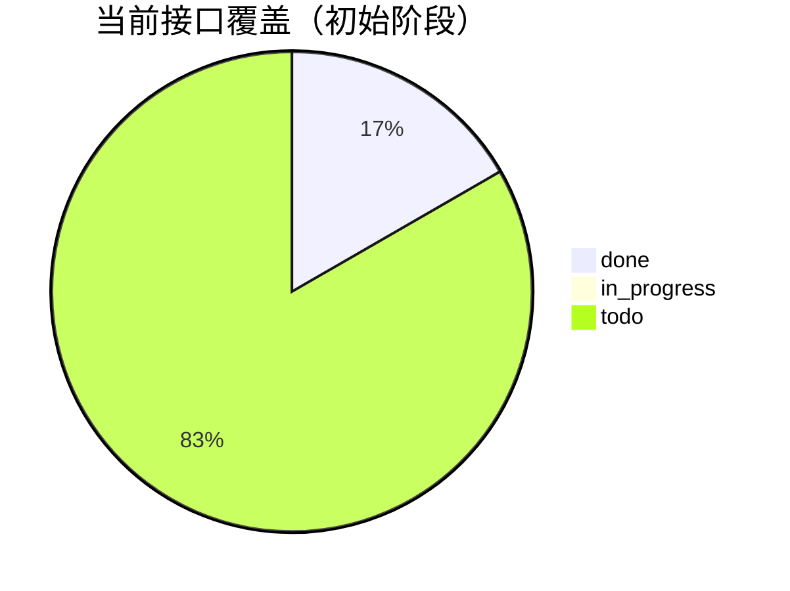

# yuanfenju-go-sdk 接口台账（Interface Catalog）

> 本文档作为“全接口对接”的单一事实源（Single Source of Truth）。
> 状态定义：`todo` / `in_progress` / `done`。

## 1. 当前进度总览

- 已实现：4
- 进行中：0
- 待实现：持续补充（按 sitemap 逐批录入）

> 说明：`todo` 初始值仅作为占位，后续在完成 sitemap 全量录入后会替换为真实数量。

---

## 2. 已实现接口

| domain | name_cn | method_name | http_method | path | priority | status | response_typed | test_status |
|---|---|---|---|---|---|---|---|---|
| free | 账户查询 | QueryMerchant | POST | /v1/Free/querymerchant | P0 | done | typed struct | none |
| free | 调用查询 | QueryTimes | POST | /v1/Free/querytimes | P0 | done | typed struct | none |
| bazi | 八字排盘 | Paipan | POST | /v1/Bazi/paipan | P0 | done | typed + raw json | none |
| zhanbu | 每日一占 | Meiri | POST | /v1/Zhanbu/meiri | P0 | done | typed + raw json | none |

---

## 3. 待录入业务域（来自 sitemap）

> 以下为第一批需要完成“接口清单录入”的域，录入后再进入代码实现批次。

| domain | status | 说明 |
|---|---|---|
| free | in_progress | 继续补充 Free 全部接口 |
| bazi | in_progress | 继续补充 Bazi 全部接口 |
| zhanbu | in_progress | 继续补充 Zhanbu 全部接口 |
| tools | todo | 工具类接口 |
| peidui | todo | 配对类接口 |
| yuce | todo | 预测类接口 |
| xingming | todo | 姓名类接口 |
| qiming | todo | 起名类接口 |
| laohuangli | todo | 老黄历等日期类接口 |

---

## 4. 录入规范（执行约束）

每新增一个接口台账项，至少填写以下字段：

- `domain`
- `name_cn`
- `method_name`
- `http_method`
- `path`
- `priority`
- `status`
- `response_typed`
- `test_status`

命名规范：

- `method_name` 必须与 SDK 暴露方法一致（UpperCamelCase）。
- `path` 必须使用完整路由（如 `/v1/Bazi/paipan`）。
- `response_typed` 仅允许：`typed struct` / `typed + raw json` / `raw json`。

---

## 5. 下一步（本周执行）

1. 按 sitemap 把 `free/bazi/zhanbu` 三个域的接口先完整录入。
2. 对已录入接口逐项补“请求参数说明”和“响应字段说明”（可附链接）。
3. 开始 Batch-1 实施：按域分 PR，每个 PR 控制在 3~8 个接口。
