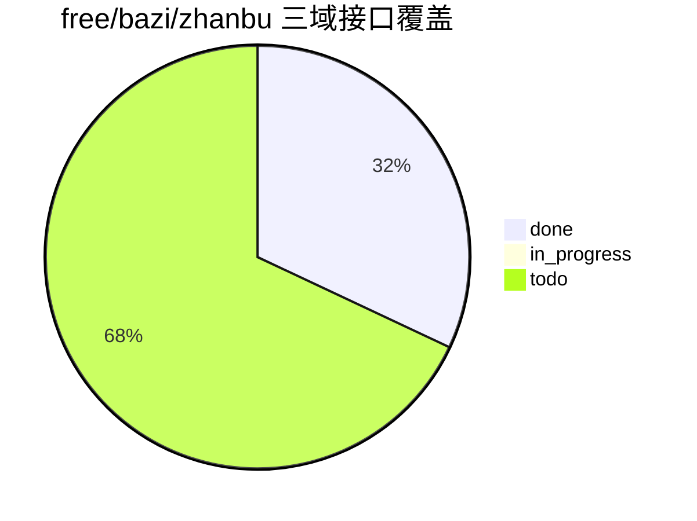

# yuanfenju-go-sdk 接口台账（Interface Catalog）

> 本文档作为“全接口对接”的单一事实源（Single Source of Truth）。
> 当前已完成 `free/bazi/zhanbu` 三个域的 sitemap 全量录入（统计日期：2026-03-19）。

状态定义：`todo` / `in_progress` / `done`。

## 1. 当前进度总览（已录入域）

- 已录入总数：25
- 已实现：8
- 进行中：0
- 待实现：17

---

## 2. 接口明细（free/bazi/zhanbu）

| domain | name_cn | method_name | http_method | path | priority | status | response_typed | test_status |
|---|---|---|---|---|---|---|---|---|
| free | 账户查询 | QueryMerchant | POST | /v1/Free/querymerchant | P0 | done | typed struct | unit |
| free | 调用查询 | QueryTimes | POST | /v1/Free/querytimes | P0 | done | typed struct | unit |
| bazi | 九星命理 | Jiuxing | POST | /v1/Bazi/jiuxing | P1 | done | typed struct | unit |
| bazi | 八字合婚 | Hehun | POST | /v1/Bazi/hehun | P1 | done | typed struct | unit |
| bazi | 八字合盘 | Hepan | POST | /v1/Bazi/hepan | P1 | todo | typed struct | none |
| bazi | 八字排盘 | Paipan | POST | /v1/Bazi/paipan | P0 | done | typed struct | unit |
| bazi | 八字测算 | Cesuan | POST | /v1/Bazi/cesuan | P1 | todo | typed struct | none |
| bazi | 八字精盘 | Jingpan | POST | /v1/Bazi/jingpan | P1 | todo | typed struct | none |
| bazi | 八字精算 | Jingsuan | POST | /v1/Bazi/jingsuan | P1 | todo | typed struct | none |
| bazi | 未来运势 | Weilai | POST | /v1/Bazi/weilai | P1 | todo | typed struct | none |
| bazi | 紫微排盘 | Zwpan | POST | /v1/Bazi/zwpan | P1 | todo | typed struct | none |
| bazi | 称骨论命 | Chenggu | POST | /v1/Bazi/chenggu | P2 | todo | typed struct | none |
| bazi | 骨相论命 | Guxiang | POST | /v1/Bazi/guxiang | P2 | todo | typed struct | none |
| bazi | 生日论命 | Shengri | POST | /v1/Bazi/shengri | P2 | todo | typed struct | none |
| bazi | 八字每日运势 | Yunshi | POST | /v1/Bazi/yunshi | P1 | todo | typed struct | none |
| bazi | 流年财运分析 | Caiyunfenxi | POST | /v1/Bazi/caiyunfenxi | P1 | todo | typed struct | none |
| zhanbu | 塔罗牌解读(新版) | Taluojiedu | POST | /v1/Zhanbu/taluojiedu | P1 | todo | typed struct | none |
| zhanbu | 塔罗洗牌(旧版) | Taluoxipai | POST | /v1/Zhanbu/taluoxipai | P2 | todo | typed struct | none |
| zhanbu | 一张牌占卜(旧版) | Taluozhanbu | POST | /v1/Zhanbu/taluozhanbu | P2 | todo | typed struct | none |
| zhanbu | 多牌阵占卜(旧版) | Taluospreads | POST | /v1/Zhanbu/taluospreads | P2 | todo | typed struct | none |
| zhanbu | 小六壬占卜 | Xiaoliuren | POST | /v1/Zhanbu/xiaoliuren | P1 | done | typed struct | unit |
| zhanbu | 指纹占卜 | Zhiwen | POST | /v1/Zhanbu/zhiwen | P1 | done | typed struct | unit |
| zhanbu | 摇卦占卜 | Yaogua | POST | /v1/Zhanbu/yaogua | P1 | todo | typed struct | none |
| zhanbu | 每日一占 | Meiri | POST | /v1/Zhanbu/meiri | P0 | done | typed struct | unit |
| zhanbu | 星座每日运势 | Yunshi | POST | /v1/Zhanbu/yunshi | P1 | todo | typed struct | none |
| zhanbu | 生肖每日运势 | Shengxiaoyunshi | POST | /v1/Zhanbu/shengxiaoyunshi | P1 | todo | typed struct | none |

---

## 3. 域录入状态（全站）

| domain | status | 说明 |
|---|---|---|
| free | done | sitemap 录入完成 |
| bazi | done | sitemap 录入完成 |
| zhanbu | done | sitemap 录入完成 |
| tools | todo | 待录入 |
| peidui | todo | 待录入 |
| yuce | todo | 待录入 |
| xingming | todo | 待录入 |
| qiming | todo | 待录入 |
| laohuangli | todo | 待录入 |

---

## 4. 录入规范（执行约束）

每新增一个接口台账项，至少填写以下字段：

- `domain`
- `name_cn`
- `method_name`
- `http_method`
- `path`
- `priority`
- `status`
- `response_typed`
- `test_status`

命名规范：

- `method_name` 必须与 SDK 暴露方法一致（UpperCamelCase）。
- `path` 必须使用完整路由（如 `/v1/Bazi/paipan`）。
- `response_typed` 仅允许：`typed struct`（禁止 map/raw json 动态结构）。

---

## 5. 下一步（执行顺序）

1. Batch-1 继续实现：`bazi/hepan`（P1）。
2. Batch-1 继续实现：`bazi/cesuan`（P1）。
3. Batch-1 继续实现：`zhanbu/yaogua`（P1）。
